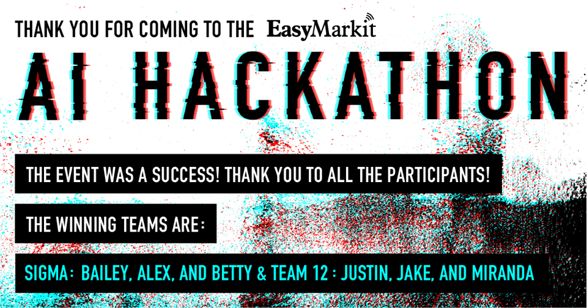

# EasyMarkit AI Hackathon Winning submission by Team Sigma




Members: Betty Zhou, Bailey Lei, Alex Pak

## Team Sigma

|Name|Github.com User Id|
|--|--|
|Bailey Lei|[blei7](https://github.com/blei7)|
|Alex Pak|[pak-alex](https://github.com/pak-alex)|
|Betty Zhou|[bettybhzhou](https://github.com/bettybhzhou)|


## EasyMarkit AI Hackathon: Improving Medical Patient Communication through AI

The event is hosted by [EasyMarkit](https://www.easymarkit.com) with the following partners: Lighthouse Labs, BCJobs & Google. The challenge is to accurately predict communication from patients using a given data set and present these findings to the panel, with a business recommendation.

## Dependencies

Install dependencies by using the command:

```
pip install -r requirements.txt
```
## Usage


Provide data files and run the following command to train, fit and output submission set:

**Note: Raw data files from the competition are unavailable due to privacy reasons**

```
python sigma_script.py data/train.csv data/test.csv
```
